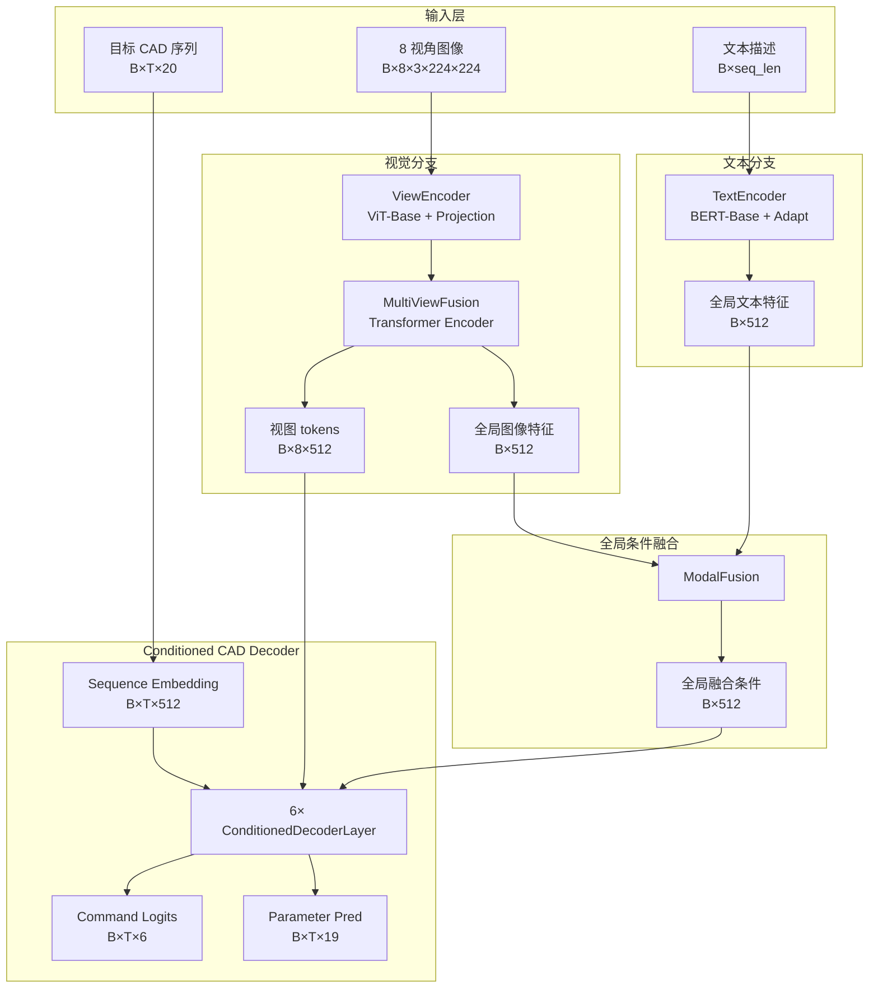

# DM-CAD 架构迭代 V1 设计文档

> **版本**: 1.0
> **最后更新**: 2026-04-03
> **状态**: 已实现并通过训练启动验证

---

## 1. 迭代目标

本次架构迭代聚焦两个问题：

1. 视觉条件在进入 Decoder 前被过度压缩。
2. 条件信息只在 Decoder 输入处注入一次，深层约束不足。

对应地，本次 V1 实现两项改造：

- **全量视图级视觉特征注入**
- **多级残差条件注入**

本轮不改动损失函数设计，也不引入 patch-level memory 或 token-level 文本 memory。

---

## 2. 新架构概览



---

## 3. 与旧架构的关键差异

### 3.1 视觉条件从单向量改为视图级 memory

旧架构中，多视图融合模块只返回一个全局向量：

- `z_img`: `B×512`

新架构中，多视图融合模块同时返回：

- `z_img_tokens`: `B×8×512`
- `z_img_global`: `B×512`

其中：

- `z_img_tokens` 作为 Decoder Cross-Attention 的 `memory`
- `z_img_global` 继续用于与文本特征融合，构造全局条件

这样 Decoder 在每个生成步都可以从 8 个视图 token 中自行选择关注对象，而不是只依赖单个压缩后的视觉向量。

### 3.2 条件注入从单次注入改为逐层注入

旧架构中，融合条件只作为一个 `memory token` 输入标准 `TransformerDecoder`。

新架构中：

- 视觉 memory 使用 `B×8×512`
- 全局融合条件 `z_fused_global: B×512`
- 在每个 Decoder Layer 末尾执行一次残差式条件注入

---

## 4. 张量形状

### 4.1 编码阶段

- 输入图像：`images: [B, 8, 3, 224, 224]`
- 单视图编码后：`view_features_flat: [B*8, 512]`
- reshape 后：`view_features: [B, 8, 512]`
- 多视图编码输出：
  - `z_img_tokens: [B, 8, 512]`
  - `z_img_global: [B, 512]`
- 文本编码输出：
  - `z_txt_global: [B, 512]`
- 模态融合输出：
  - `z_fused_global: [B, 512]`

### 4.2 解码阶段

- 目标 CAD 序列：`tgt_seq: [B, T, 20]`
- 右移后的 decoder 输入：`decoder_input: [B, T, 20]`
- 序列嵌入后：`tgt_embed: [B, T, 512]`
- 视觉 memory：`visual_memory: [B, 8, 512]`
- 全局条件：`global_condition: [B, 512]`
- Decoder 输出：
  - `cmd_logits: [B, T, 6]`
  - `param_pred: [B, T, 19]`

推理时输出：

- `cmd_pred: [B, steps]`
- `param_pred: [B, steps, 19]`

---

## 5. Decoder Layer 设计

每一层 `ConditionedDecoderLayer` 包含四个阶段：

1. **Masked Self-Attention**
2. **Cross-Attention to Visual Memory**
3. **Feed-Forward Network**
4. **Residual Condition Injection**

形式化表示为：

```text
h1 = LN(h + SelfAttn(h))
h2 = LN(h1 + CrossAttn(h1, visual_memory))
h3 = LN(h2 + FFN(h2))
gamma_l, beta_l = MLP_l(global_condition)
h4 = h3 + s * (gamma_l * h3 + beta_l)
```

其中：

- `h`: `B×T×512`
- `visual_memory`: `B×8×512`
- `global_condition`: `B×512`
- `gamma_l, beta_l`: `B×512`
- `s`: `decoder_condition_scale`

本轮实现的注入方式为：

- `decoder_condition_injection = film_residual`

---

## 6. 配置项

本轮新增配置项如下：

```yaml
model:
  visual_memory_mode: view_tokens
  use_global_fused_condition: true
  decoder_condition_injection: film_residual
  decoder_condition_hidden_dim: 512
  decoder_condition_scale: 1.0
```

含义：

- `visual_memory_mode`
  - `view_tokens`: 使用 8 个视图 token 作为 decoder memory
  - `global_only`: 退回单全局向量 memory 方案
- `use_global_fused_condition`
  - 是否启用每层全局条件注入
- `decoder_condition_injection`
  - 当前实现 `film_residual`
- `decoder_condition_hidden_dim`
  - 每层条件 MLP 的中间维度
- `decoder_condition_scale`
  - 控制条件注入强度

实验配置文件：

- `train/config_full_arch_iter_v1.yaml`

---

## 7. 参数量变化

相对旧架构，本轮主要增加的是每层 Decoder 的条件注入 MLP：

- 每层新增参数：`787,968`
- 6 层合计新增参数：`4,727,808`

预计参数量变化为：

- 总参数：从 `230.32M` 增加到约 `235.05M`
- 可训练参数：从 `35.04M` 增加到约 `39.77M`

由于视觉 memory 长度仅从 `1` 增加到 `8`，而非 patch-level token，因此显存与训练时间通常只会小幅增加，和原版接近属于正常现象。

---

## 8. 训练与推理兼容性

### 8.1 不变部分

- 训练入口 `train_main.py` 不需要改调用方式
- 推理入口 `infer.py` 不需要改外部接口
- 损失函数 `train/loss.py` 不需要改
- 数据集与评估逻辑不需要改

### 8.2 改动部分

- 模型内部从单条件向量改为：
  - 视图级视觉 memory
  - 全局融合条件逐层注入

### 8.3 检查结果

当前版本已经验证：

- 配置可正常加载
- 模型可正常启动训练
- 多卡训练可进入实际 batch 训练

---

## 9. 后续可能扩展

本轮未做但后续可继续探索：

1. 将视觉 memory 从视图级 token 扩展到 patch-level token
2. 保留文本 token 序列并与视觉 token 一起组成联合 memory
3. 将条件注入从 `film_residual` 扩展为 AdaLN / AdaIN 风格
4. 引入 command-level hierarchical decoding

