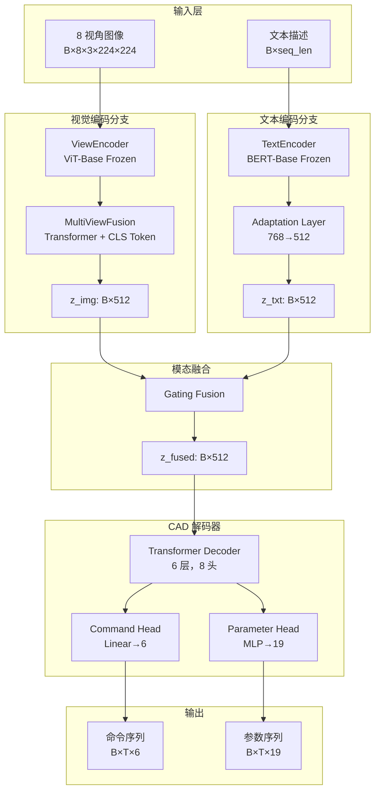
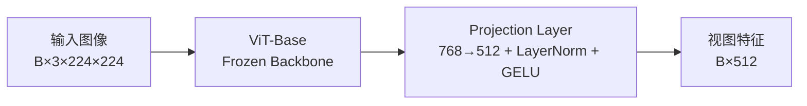
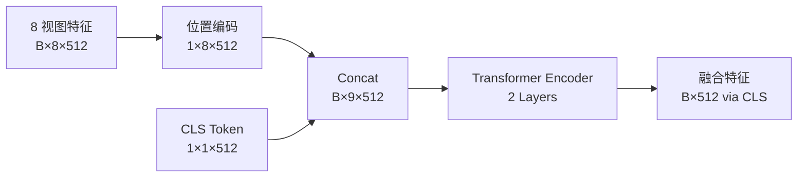
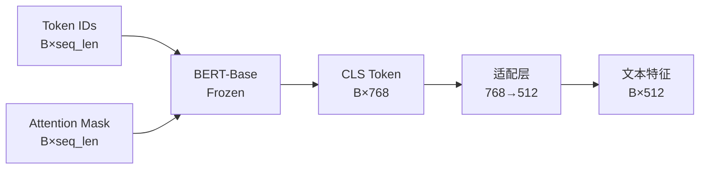
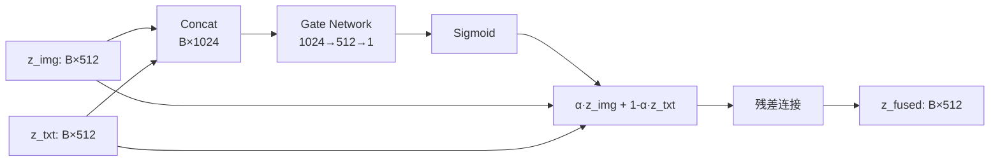
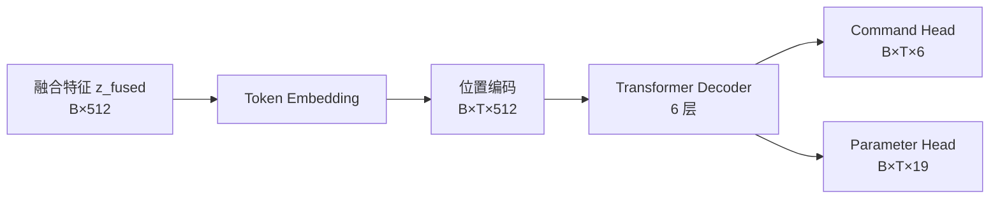
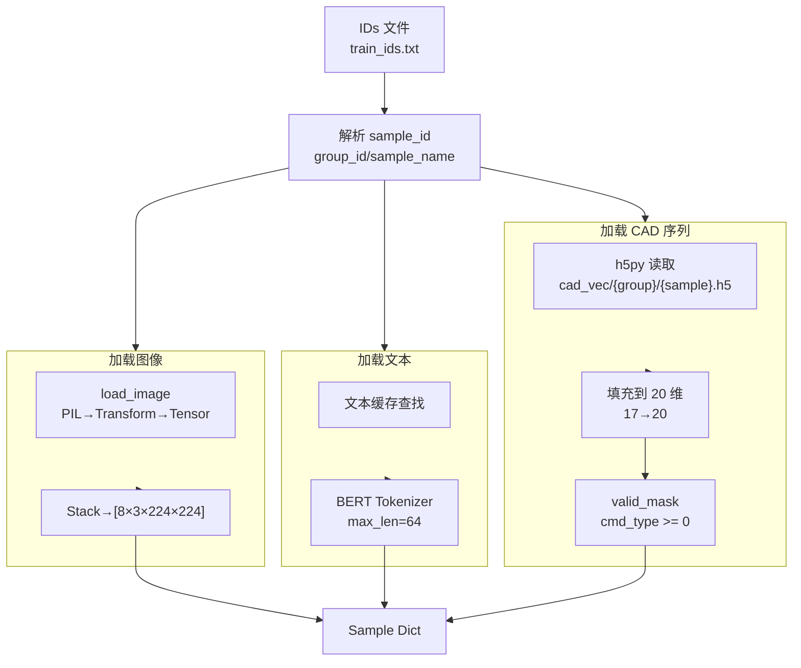

# DM-CAD：双模态 CAD 生成网络设计文档

> **版本**: 2.1 (Typora 修复版)
> **最后更新**: 2026-03-27
> **状态**: 反映当前实际代码实现

---

## 1. 项目概述

### 1.1 系统目标

DM-CAD 是一个**双模态条件 CAD 序列生成系统**，输入为：
- **图像模态**: 8 视角 CAD 线框图（224×224 RGB）
- **文本模态**: 自然语言描述（英文）

输出为：**DeepCAD 格式的参数化 CAD 命令序列**（6 种命令类型，19 维参数）

### 1.2 核心架构概览



---

## 2. 核心组件详解

### 2.1 视觉编码器 (ViewEncoder)

**文件**: `models/view_encoder.py`



**实现细节**:
- **Backbone**: `timm.models.vision_transformer.vit_base_patch16_224`
- **预训练**: ImageNet 预训练权重（默认启用）
- **冻结策略**: 默认冻结 ViT 所有参数，仅训练投影层
- **输出维度**: 512 维特征向量

**代码关键路径**:
```python
# models/view_encoder.py:16-48
class ViewEncoder(nn.Module):
    def __init__(self, embed_dim=512, pretrained=True, freeze_backbone=True):
        self.vit = vit_base_patch16_224(pretrained=pretrained)
        self.vit.head = nn.Identity()  # 移除分类头
        self.project = nn.Sequential(
            nn.Linear(768, embed_dim),
            nn.LayerNorm(embed_dim),
            nn.GELU()
        )
        if freeze_backbone:
            self.freeze_backbone()
```

---

### 2.2 多视图融合 (MultiViewFusion)

**文件**: `models/view_encoder.py` (L51-L91)



**实现细节**:
- **CLS Token 模式**: 在 8 个视图前插入可学习的 [CLS] 向量
- **位置编码**: 每个视图位置有独立的可学习位置编码
- **注意力机制**: 2 层 Transformer Encoder，8 头注意力
- **聚合方式**: 取编码后序列的第一个位置（[CLS]）作为全局表示

**代码关键路径**:
```python
# models/view_encoder.py:77-91
def forward(self, view_features):
    batch_size = view_features.shape[0]
    cls_tokens = self.cls_token.expand(batch_size, -1, -1)
    view_features = view_features + self.view_pos_embed.expand(batch_size, -1, -1)
    transformer_input = torch.cat([cls_tokens, view_features], dim=1)
    encoded = self.transformer(transformer_input)
    fused = encoded[:, 0]
    return self.aggregate(fused)
```

---

### 2.3 文本编码器 (TextEncoder)

**文件**: `models/text_encoder.py`



**实现细节**:
- **预训练模型**: `bert-base-uncased` (Hugging Face Transformers)
- **冻结策略**: 默认冻结所有 BERT 参数
- **池化方式**: 使用 [CLS] token 作为句子表示
- **适配层结构**: Linear(768→512) + LayerNorm + GELU + Dropout(0.1)

**代码关键路径**:
```python
# models/text_encoder.py:31-41
def forward(self, input_ids, attention_mask):
    outputs = self.bert(input_ids=input_ids, attention_mask=attention_mask)
    cls_embedding = outputs.last_hidden_state[:, 0, :]
    return self.adapt(cls_embedding)
```

---

### 2.4 模态融合 (ModalFusion)

**文件**: `models/fusion.py`

**支持三种融合策略**（通过配置切换）:

#### Gating Fusion（默认）



**实现细节**:
```python
concat = torch.cat([z_img, z_txt], dim=-1)
alpha = torch.sigmoid(self.gate_proj(concat))
alpha_adj = alpha * (1 - self.img_bias) + self.img_bias
z_fused = alpha_adj * z_img + (1 - alpha_adj) * z_txt
return self.norm(z_fused + z_img)
```

#### Concat Fusion

```python
fused = self.concat_proj(torch.cat([z_img, z_txt], dim=-1))
return self.norm(fused)
```

#### Cross-Attention Fusion

```python
query = z_img.unsqueeze(1)
key_value = torch.stack([z_img, z_txt], dim=1)
attended, _ = self.cross_attention(query=query, key=key_value, value=key_value)
return self.norm(attended.squeeze(1) + z_img)
```

---

### 2.5 CAD 解码器 (CADDecoder)

**文件**: `models/cad_decoder.py`



**命令类型（6 种 DeepCAD 格式）**:

| ID | 名称 | 说明 | 有效参数维度 |
|----|------|------|-------------|
| 0 | Line | 线段 | [0:2] x, y |
| 1 | Arc | 圆弧 | [0:4] x, y, alpha, f |
| 2 | Circle | 圆 | [0:3] x, y, r |
| 3 | EOS | 序列结束 | 无 |
| 4 | SOL | 实体开始 | 无 |
| 5 | Ext | 拉伸 | [5:16] 11 维挤压参数 |

**参数掩码**（仅在有效维度计算 Loss）:
```python
# train/loss.py:12-19
CMD_PARAM_MASK = torch.tensor([
    [1, 1, 0, 0, 0, 0, 0, 0, 0, 0, 0, 0, 0, 0, 0, 0, 0, 0, 0],  # Line
    [1, 1, 1, 1, 0, 0, 0, 0, 0, 0, 0, 0, 0, 0, 0, 0, 0, 0, 0],  # Arc
    [1, 1, 0, 0, 1, 0, 0, 0, 0, 0, 0, 0, 0, 0, 0, 0, 0, 0, 0],  # Circle
    [0, 0, 0, 0, 0, 0, 0, 0, 0, 0, 0, 0, 0, 0, 0, 0, 0, 0, 0],  # EOS
    [0, 0, 0, 0, 0, 0, 0, 0, 0, 0, 0, 0, 0, 0, 0, 0, 0, 0, 0],  # SOL
    [0, 0, 0, 0, 0, 1, 1, 1, 1, 1, 1, 1, 1, 1, 1, 1, 0, 0, 0],  # Ext
], dtype=torch.bool)
```

**训练流程（Teacher Forcing + Causal Mask）**:
```python
# models/cad_decoder.py:102-110
def _shift_right(self, tgt_seq):
    start_seq = self._build_start_sequence(tgt_seq.shape[0], tgt_seq.device)
    return torch.cat([start_seq, tgt_seq[:, :-1, :]], dim=1)

def _build_causal_mask(self, seq_len, device):
    return torch.triu(
        torch.full((seq_len, seq_len), float('-inf'), device=device),
        diagonal=1
    )
```

**推理流程（自回归生成）**:
```python
# models/cad_decoder.py:112-164
def generate(self, z_fused, max_steps=120):
    for _ in range(max_steps):
        output = self.transformer_decoder(tgt_embed, memory=memory, tgt_mask=causal_mask)
        cmd_pred = torch.argmax(cmd_logits, dim=-1)
        ended = ended | (cmd_pred.squeeze(-1) == 3)
        if ended.all():
            break
```

---

## 3. 数据管道

### 3.1 数据集类 (CADDataset)

**文件**: `data/dataset.py`

**数据目录结构**:
```
datasets/dataset_v1/
├── train_ids_5k.txt
├── test_ids_5k.txt
├── cad_desc/
│   └── <group_id>.json
├── cad_img/
│   └── <group_id>/
│       └── <sample_id>/
│           └── <sample_id>_{000-007}.png
└── cad_vec/
    └── <group_id>/
        └── <sample_id>.h5
```

**数据加载流程**:



**返回样本格式**:
```python
{
    'sample_id': 'group_01/sample_123',
    'images': torch.FloatTensor(8, 3, 224, 224),
    'text': 'A rectangular box with a cylindrical hole...',
    'text_input_ids': torch.LongTensor(64),
    'text_attention_mask': torch.LongTensor(64),
    'cad_seq': torch.FloatTensor(seq_len, 20),
    'cad_valid_mask': torch.BoolTensor(seq_len)
}
```

---

### 3.2 数据增强 (CADDataAugmentation)

**文件**: `data/augment.py`

**图像增强**（训练时使用）:
- **ColorJitter**: brightness=0.2, contrast=0.2
- **RandomRotation**: ±15 度
- **RandomAffine**: translate=(0.1, 0.1)

**文本增强**（可选）:
- 同义词替换（概率控制）
- 随机词删除（概率控制）

---

## 4. 训练系统

### 4.1 损失函数

**文件**: `train/loss.py`

**总损失**:
```
L_total = cmd_weight * L_cmd + param_weight * L_param
```

**命令损失**（CrossEntropy，仅有效位置）:
```python
cmd_gt_clamped = cmd_gt.clamp(min=0, max=cmd_logits.shape[-1] - 1)
flat_cmd_loss = self.cmd_criterion(cmd_logits.reshape(-1, ...), cmd_gt_clamped.reshape(-1))
cmd_loss = flat_cmd_loss[valid_mask.reshape(-1)].mean()
```

**参数损失**（SmoothL1，仅命令特定有效维度）:
```python
cmd_param_mask = self.cmd_param_mask.to(cmd_gt_clamped.device)[cmd_gt_clamped]
combined_mask = valid_mask.unsqueeze(-1) & cmd_mask
param_loss = param_loss_all[combined_mask].mean()
```

---

### 4.2 训练器 (Trainer)

**文件**: `train/train.py`

**关键特性**:
- **AMP 混合精度**: `torch.cuda.amp.GradScaler` + `autocast`
- **梯度裁剪**: `clip_grad_norm_(parameters, grad_clip)`
- **DataParallel**: 可配置多 GPU 支持
- **TensorBoard**: 自动记录训练/验证指标
- **检查点管理**: 自动保存 best.pth 和 epoch_*.pth

---

### 4.3 优化器与调度器

**默认配置**:
```yaml
optimizer:
  type: AdamW
  lr: 5.0e-05
  weight_decay: 0.01

scheduler:
  type: CosineAnnealingLR
  T_max: 80
  eta_min: 1.0e-06
```

---

## 5. 评估系统

### 5.1 评估指标

**文件**: `eval/metrics.py`

**核心指标**:
1. **Command Accuracy**: 命令类型预测准确率
2. **Parameter Accuracy**: 参数预测准确率（绝对误差 < 0.1）
3. **Combined Score**: 0.5 × cmd_acc + 0.5 × param_acc

---

### 5.2 评估流程

**文件**: `eval/evaluate.py`

**评估模式**（生成式）:
```python
cmd_pred, param_pred = model.generate(images, text_ids, text_mask, max_steps=seq_len)
cmd_acc = (cmd_pred == gt_cmds)[valid_mask].mean()
param_acc = (abs(pred - gt) < 0.1)[combined_mask].mean()
```

---

## 6. 配置系统

**文件位置**: `train/*.yaml`

**核心配置项**:
```yaml
model:
  embed_dim: 512
  n_heads: 8
  n_layers: 6
  max_seq_len: 120
  n_views: 8
  fusion_type: gating
  freeze_vit: true

training:
  batch_size: 4
  num_epochs: 80
  lr: 5.0e-05
  gradient_clip: 1.0
  precision: bf16

data:
  img_size: 224
  text_max_len: 64
  data_root: datasets/dataset_v1
  train_ids_file: train_ids_5k.txt
  test_ids_file: test_ids_5k.txt

device:
  type: cuda
  visible_devices: [0]
  use_data_parallel: false
  output_device: 0
```

---

## 7. 命令行接口

### 7.1 训练
```bash
python train_main.py --config train/config.yaml
python train_main.py --config train/config.yaml --resume checkpoints/epoch_10.pth
```

### 7.2 评估
```bash
python eval_main.py --checkpoint checkpoints/best.pth
python eval_main.py --checkpoint checkpoints/best.pth --max_batches 10
```

### 7.3 推理
```bash
python infer.py --checkpoint checkpoints/best.pth --images view_00.png ... view_07.png --text "description"
python infer.py --checkpoint checkpoints/best.pth --config train/config_5k.yaml --split test --sample-index 0
```

---

## 8. 张量维度总结

| 模块 | 输入 | 输出 | 关键参数 |
|------|------|------|----------|
| ViewEncoder | `[B, 3, 224, 224]` | `[B, 512]` | ViT-Base, frozen |
| MultiViewFusion | `[B, 8, 512]` | `[B, 512]` | CLS Token, 2 层 Transformer |
| TextEncoder | `[B, seq_len]` + mask | `[B, 512]` | BERT-Base, frozen |
| ModalFusion | `[B, 512]`, `[B, 512]` | `[B, 512]` | gating/concat/cross_attn |
| CADDecoder | `[B, 512]` + `[B, T, 20]` | `[B, T, 6]`, `[B, T, 19]` | 6 层 Decoder, causal mask |

---

## 9. 关键设计决策

1. **为什么冻结 ViT 和 BERT？**
   - 数据效率：5k-20k 规模的数据集不足以支撑从头训练大模型
   - 训练稳定性：冻结预训练 backbone 减少过拟合风险
   - 计算效率：减少 70%+ 的可训练参数，加速收敛

2. **为什么使用 CLS Token 进行多视图融合？**
   - 主动选择：CLS token 通过自注意力机制可以学习关注最重要的视图角度
   - 全局表示：比简单平均/最大池化更能捕捉跨视图的几何一致性

3. **为什么 Gating Fusion 是默认选择？**
   - 动态权重：根据输入内容自适应调整图像/文本贡献
   - 图像偏置：CAD 几何信息主要来自图像，文本提供辅助语义

---

## 10. 相关文件索引

| 文件 | 说明 |
|------|------|
| `models/dual_modal_cad.py` | 完整模型 |
| `models/view_encoder.py` | 视觉编码 + 多视图融合 |
| `models/text_encoder.py` | 文本编码 |
| `models/fusion.py` | 模态融合 |
| `models/cad_decoder.py` | CAD 序列解码 |
| `data/dataset.py` | 数据集类 + DataLoader |
| `data/augment.py` | 数据增强 |
| `train/train.py` | 训练器 |
| `train/loss.py` | 损失函数 |
| `eval/evaluate.py` | 评估器 |
| `eval/metrics.py` | 评估指标 |
| `train_main.py` | 训练入口 |
| `eval_main.py` | 评估入口 |
| `infer.py` | 推理入口 |
| `runtime_device.py` | 设备管理工具 |

---

## 11. 参考文献

1. **DeepCAD**: Wu et al. "DeepCAD: A Deep Generative Network for Computer-Aided Design Models." ICCV 2021.
2. **Text2CAD**: Khan et al. "Text2CAD: Generating Sequential CAD Designs from Text Prompts." NeurIPS 2024.
3. **ViT**: Dosovitskiy et al. "An Image is Worth 16x16 Words: Transformers for Image Recognition at Scale." ICLR 2021.
4. **BERT**: Devlin et al. "BERT: Pre-training of Deep Bidirectional Transformers for Language Understanding." NAACL 2019.

---

**文档说明**: 本文档基于实际代码实现编写。如与早期设计文档 (`deprecated_dual_modal_cad_design.md`) 有冲突，以本文档为准。
